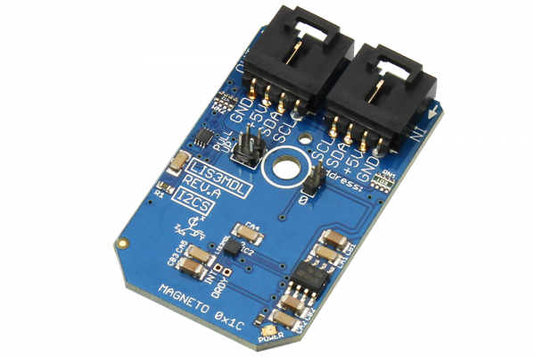

[](https://store.ncd.io/product/lis3mdl-3-axis-magnetometer-16-bit-i2c-mini-module/).

# LIS3MDL

The LIS3MDL is an ultra-low-power high-performance three-axis magnetic sensor.The self-test capability allows the user to check the functioning of the sensor in the final application.The device may be configured to generate interrupt signals for magnetic field detection.
This Device is available from www.ncd.io

[SKU: LIS3MDL]

(https://store.ncd.io/product/lis3mdl-3-axis-magnetometer-16-bit-i2c-mini-module/)
This Sample code can be used with Raspberry Pi.

Hardware needed to interface LIS3MDL 3axis magnetometer sensor With Raspberry Pi :

1. <a href="https://store.ncd.io/product/lis3mdl-3-axis-magnetometer-16-bit-i2c-mini-module/">LIS3MDL 16bit 3axis magnetometer sensor</a>

2. <a href="https://store.ncd.io/product/i2c-shield-for-raspberry-pi-3-pi2-with-outward-facing-i2c-port-terminates-over-hdmi-port/">Raspberry Pi I2C Shield</a>

3. <a href="https://store.ncd.io/product/i%C2%B2c-cable/">I2C Cable</a>

## Python

Download and install smbus library on Raspberry pi. Steps to install smbus are provided at:

https://pypi.python.org/pypi/smbus-cffi/0.5.1

Download (or git pull) the code in pi. Run the program.

```cpp
$> python LIS3MDL.py
```
The lib is a sample library, you will need to calibrate the sensor according to your application requirement.
